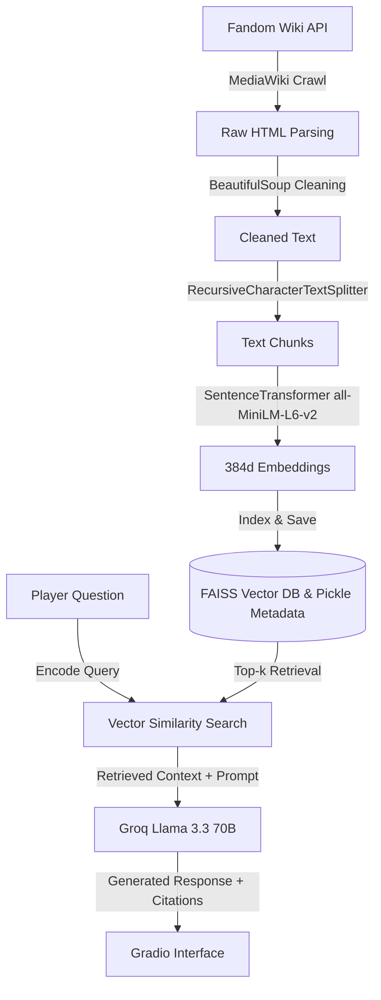

# 🪴 Grow a Garden - Auto-Crawled Wiki RAG AI Assistant


An end-to-end Retrieval-Augmented Generation (RAG) system and interactive web application designed to automatically crawl, index, and answer game-related queries for **"Grow a Garden"** using official Fandom Wiki content.

Powered by **Groq (`llama-3.3-70b-versatile`)**, **FAISS**, **SentenceTransformers (`all-MiniLM-L6-v2`)**, and **Gradio**, this project turns raw wiki articles into an intelligent conversational assistant with verifiable source citations.

---

## 🌟 Key Features

- **🌐 Automated MediaWiki API Crawler**: Dynamically fetches, filters, and parses article pages directly from the official Fandom Wiki MediaWiki API (`api.php`) without needing manual data dumps.
- **📄 Smart Document Chunking**: Utilizes `langchain_text_splitters.RecursiveCharacterTextSplitter` (500 char chunk size, 100 overlap) to preserve semantic context across tables, infoboxes, and article sections.
- **⚡ High-Performance FAISS Vector DB**: Encodes text chunks into 384-dimensional dense vectors using HuggingFace's `all-MiniLM-L6-v2` model and builds a local L2 similarity search index.
- **🧠 Groq LLM Reasoning**: Harnesses the ultra-fast Groq API running `llama-3.3-70b-versatile` to synthesize accurate, context-bound game advice.
- **📌 Verifiable Citations**: Every answer includes clickable Markdown citations linking directly back to the original Fandom Wiki articles.
- **🖥️ Dual-Tab Gradio Web Interface**:
  - **Knowledge Base Manager**: Run the auto-crawler on demand or instantly load existing pre-built indexes (`grow_a_garden.index` & `knowledge_data.pkl`).
  - **Query Assistant**: Ask questions with customizable system personality prompts.

---

## 🏗️ System Architecture & RAG Pipeline



---

## 📁 Repository Structure

```
├── project.ipynb           # Main Jupyter Notebook containing RAG pipeline & Gradio GUI
├── grow_a_garden.index     # Serialized FAISS vector index (binary)
├── knowledge_data.pkl      # Pickled text chunks & article metadata
├── .envsample              # Sample environment configuration file
├── .gitignore              # Ignored environment and cache directories
├── .env                    # Environment variables configuration (gitignored)
└── README.md               # Project documentation
```

---

## 🚀 Quick Start Guide

### 1. Prerequisites & Virtual Environment Setup

Ensure you have **Python 3.10+** installed. Clone the repository and set up a virtual environment:

```bash
# Clone the repository
git clone https://github.com/Anush-Maharajan/Non-creditAI.git
cd Non-creditAI

# Create and activate a virtual environment
python -m venv .venv

# On Windows (PowerShell):
.\.venv\Scripts\Activate.ps1

# On macOS/Linux:
source .venv/bin/activate
```

### 2. Install Dependencies

Install all necessary packages via `pip`:

```bash
pip install groq requests beautifulsoup4 langchain-text-splitters sentence-transformers faiss-cpu gradio tqdm python-dotenv
```

### 3. Set Up API Key

Obtain an API key from [Groq Console](https://console.groq.com/) and configure it:

1. Copy `.envsample` to create a `.env` file:
   ```bash
   # On macOS/Linux:
   cp .envsample .env

   # On Windows (PowerShell/CMD):
   copy .envsample .env
   ```
2. Open `.env` and set your Groq API key:
   ```env
   GROQ_API_KEY=your_groq_api_key_here
   ```

---

## 📖 Usage Instructions

### Running the RAG Assistant Notebook (`project.ipynb`)

1. Open `project.ipynb` in VS Code or Jupyter Lab.
2. Select your virtual environment (`.venv`) as the active kernel.
3. Run all cells in `project.ipynb`.
4. Launch the **Gradio Interface** link generated at the bottom of the notebook (e.g., `http://127.0.0.1:7860`).

#### Using the App:
- **Tab 1 (Knowledge Base Manager)**:
  - Click **⚡ Load Existing Index from Disk** to load the pre-built `grow_a_garden.index` instantly.
  - Or click **🌐 Run Auto-Crawler** to scrape fresh pages from the wiki.
- **Tab 2 (Query Assistant)**:
  - Type your game question (e.g., *"What does the Gourmet Egg hatch into?"* or *"How do I get a Bagel Bunny?"*).
  - Customize the AI's personality if desired and click **Search Wiki & Answer**.

---

## 🧰 Tech Stack Summary

| Component | Technology Used |
| :--- | :--- |
| **Language** | Python 3.10+ |
| **LLM Provider** | [Groq API](https://groq.com/) (`llama-3.3-70b-versatile`) |
| **Vector Indexing** | [FAISS (Facebook AI Similarity Search)](https://github.com/facebookresearch/faiss) |
| **Embeddings** | `sentence-transformers/all-MiniLM-L6-v2` |
| **Text Chunking** | `langchain_text_splitters.RecursiveCharacterTextSplitter` |
| **Web Crawling** | MediaWiki API + `requests` + `BeautifulSoup4` |
| **UI Framework** | [Gradio 6](https://gradio.app/) |

---

## 📜 License

This project is open-source under the MIT License.

